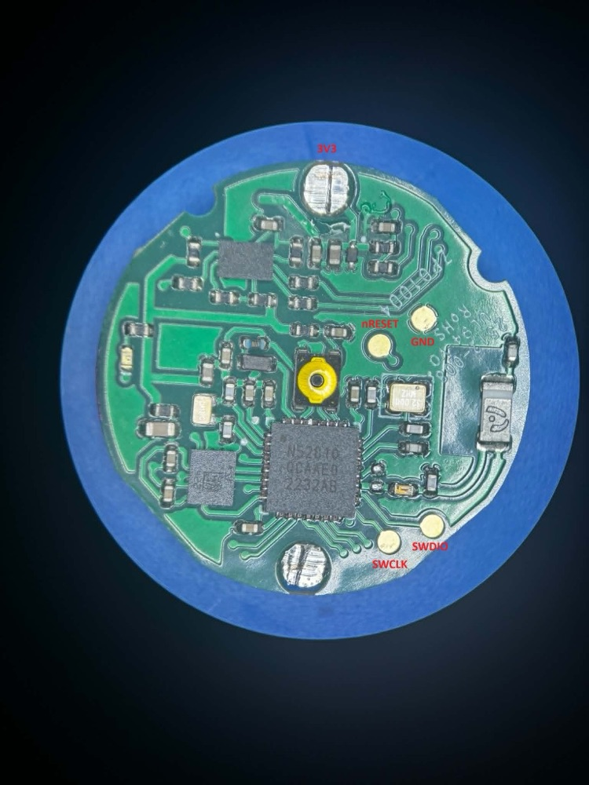
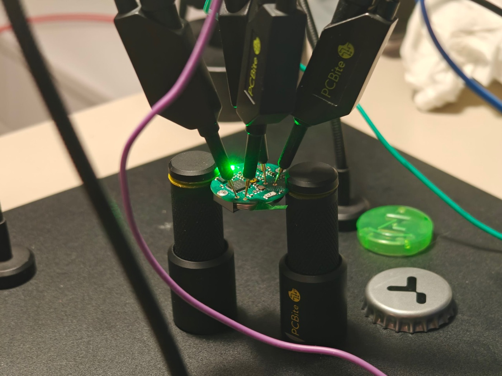

# find-my-triki

Alternatywny firmware dla kontrolera **Triki z Żabki** (nRF52810 + LSM6DSL + MX25R8035F), który
zamienia go w lokalizator widoczny jednocześnie w dwóch sieciach:

- **Apple Find My** – jako tag [OpenHaystack](https://github.com/seemoo-lab/openhaystack) ze stałym
  kluczem,
- **Google Find Hub** – jako tracker ze stałym, wcześniej wyliczonym identyfikatorem (EID), jak w
  [Everytag](https://github.com/vasimv/Everytag).

Opcjonalnie działa też dalej jako kontroler ruchu (tryb gry – patrz niżej).

Firmware jest oparty na nRF5 SDK 17.1.0 i SoftDevice S112 7.2.0. Bootloader i aplikacja
współdzielą stos BLE, więc aplikacja zajmuje ~21 KB i mieści się bezpieczne OTA dual-bank (nowa
wersja wgrywa się obok starej i zastępuje ją dopiero po sprawdzeniu).

Sprzęt opisuje [zabka-triki-hardware](https://github.com/Piwencjusz/zabka-triki-hardware). Pinout
używany przez firmware został sprawdzony na prawdziwym urządzeniu: kwarc 32,768 kHz, LED na P0.28
(aktywna stanem niskim), przycisk na P0.25, LSM6DSL na I²C P0.05/P0.06 z przerwaniem na P0.09.
Pola SWD i pełna lista pinów: *Pinout i pierwsze wgranie*.

## Do czego służy w praktyce

- Lokalizacje z sieci Apple i Google oraz dzwonienie, konfiguracja i aktualizacja firmware z
  telefonu: [OpenTagViewer-triki](https://github.com/alex-so-3/OpenTagViewer-triki) – fork [OpenTagViewer](https://github.com/parawanderer/OpenTagViewer).
- Lokalizacje Google i codzienne odświeżanie identyfikatorów: usługa [googlefind-service](https://github.com/alex-so-3/googlefind-service)
  (Docker).
- Wszystko da się też zrobić z komputera narzędziem `tools/triki_config.py`.

## Zachowanie

| Stan | Co robi tag |
|---|---|
| Ruch | co 0,5 s × `period` jedno zdarzenie reklamowe, na zmianę Apple / Google (domyślnie każda sieć co 2 s). Połączyć się można przy co czwartej ramce Apple (domyślnie co ~8 s) |
| Bezruch (po `still_timeout`, domyślnie 10 min) | co 5 s × `period` (domyślnie każda sieć co 20 s) |
| Przebudzenie | IMU (wake-up, próg domyślnie ~63 mg) zgłasza przerwanie → od razu pakiet i powrót do trybu „ruch” |
| Połączenie | każde połączenie (dzwonienie, konfiguracja) liczy się jak ruch: tag wraca do szybkiego nadawania na `still_timeout`, więc schowany, nieruszany tag łatwiej namierzyć po sygnale |
| Połączenie | ramka Apple jest łączliwa: aplikacja może w każdej chwili połączyć się z tagiem, żeby nim zadzwonić, zmienić ustawienia albo wgrać firmware (bez poprawnego hasła połączenie jest zrywane po 20 s) |
| Tryb konfiguracji | reklama „TrikiTag” z możliwością połączenia przez 120 s (dla narzędzi szukających tagu po nazwie) |
| Tryb gry | patrz niżej |
| DFU | bootloader „TrikiTagDFU”, 2 min bez połączenia → powrót do aplikacji |

Przycisk (P0.25):

- **krótko**: stan baterii na LED (3 mignięcia = pełna, 2 = OK, 1 = słaba). W trybie konfiguracji
  krótkie naciśnięcie go kończy.
- **podwójne kliknięcie**: tryb gry (2 mignięcia; 3 szybkie = tryb gry nie jest skonfigurowany).
- **3 s** (jedno mignięcie przy trzymaniu): tryb konfiguracji.
- **10 s** (seria szybkich mignięć): restart do bootloadera DFU.
- **trzymany przy włożeniu baterii / resecie**: bootloader DFU (ratunek, gdy aplikacja nie działa).

LED (P0.28) – zamiast brzęczyka:

- start: jedno długie mignięcie; 5 szybkich = brak kluczy; 2 wolne = nie wykryto IMU,
- „odtwórz dźwięk” (standard DULT, np. z aplikacji): miga przez 10 s albo do polecenia stop,
- po połączeniu z poprawnym hasłem: jedno dłuższe mignięcie; w trybie konfiguracji krótkie co sekundę,
- zapis ustawień: 3 szybkie mignięcia, potem restart,
- bootloader DFU: świeci ciągle, gaśnie po połączeniu telefonu.

Dzwonienie z samej aplikacji Google Find Hub nie działa: pełny protokół FMDN (Fast Pair) nie
mieści się w nRF52810 (~187 KB flash / ~33 KB RAM przy 192/24 KB), dlatego tag nadaje tylko
statyczny EID. Dzwoni się nim przez standard DULT (np. z forka OpenTagViewer).

## Wymagania

- nRF5 SDK 17.1.0 w `~/nrf5/nRF5_SDK_17.1.0_ddde560`
  (<https://www.nordicsemi.com/Products/Development-software/nRF5-SDK>),
  ze zbudowanym micro-ecc: `cd $SDK/external/micro-ecc && git clone https://github.com/kmackay/micro-ecc && make -C nrf52nf_armgcc/armgcc GNU_INSTALL_ROOT=...`
- Arm GNU Toolchain (arm-none-eabi) w `~/nrf5/arm-gnu-toolchain-13.3.rel1-darwin-arm64-arm-none-eabi`
- `nrfutil` + `nrfutil install nrf5sdk-tools` (klucze, ustawienia bootloadera, paczki DFU)
- OpenOCD i programator SWD – sprawdzone z J-Linkiem; inne sondy obsługiwane przez OpenOCD
  (np. CMSIS-DAP) powinny działać
- `pip install bleak cryptography` dla narzędzi w `tools/`

Ścieżki można nadpisać: `make SDK_ROOT=... GNU_INSTALL_ROOT=.../bin/`.

## Budowanie

```sh
make                 # build/triki_full.hex = SoftDevice + bootloader + aplikacja + ustawienia
make dfu             # build/triki_app_dfu.zip – podpisana paczka OTA
```

Przy pierwszym `make` powstaje `keys/dfu_private.pem` – **klucz podpisu OTA. Zrób kopię**,
bez niego nie wgrasz już nic przez OTA (zostanie tylko SWD). Katalog `keys/` nie trafia do gita.

Opcje (po zmianie `make clean`):

| Opcja | Kiedy |
|---|---|
| `APP_VERSION=n` | wersja aplikacji do DFU (musi być wyższa niż wgrana) |
| `DCDC=0` | wyłącza przetwornicę DC/DC (zostaje LDO). Domyślnie włączona: Triki ma przy pinie DCC cewki 10 µH + 15 nH, sprawdzone na sprzęcie. Na innej płytce **bez tych cewek** chip z DC/DC nie wystartuje |
| `LFCLK=RC` | płytka bez kwarcu 32,768 kHz (Triki go ma) |
| `IMU_INT2=1` | przerwanie IMU z INT2 na P0.10 zamiast INT1 na P0.09 (Triki: INT1) |
| `LED_ACTIVE_HIGH=1` | płytka z LED aktywną stanem wysokim (Triki: niskim) |

Bootloader zawsze używa oscylatora RC, więc OTA działa niezależnie od kwarcu.

## Klucze

- **Apple:** `tools/gen_apple_key.py -n NAZWA` → `keys/NAZWA.keys` (klucz prywatny – zrób kopię,
  bez niego nie odczytasz lokalizacji) i `keys/NAZWA_keyfile` (dla firmware). Pasuje też
  `*_keyfile` z `generate_keys.py` z [macless-haystack](https://github.com/dchristl/macless-haystack)
  (używany jest pierwszy klucz). Plik `.keys` importuje się do forka OpenTagViewer.
- **Google:** tracker rejestruje się na koncie narzędziem
  [GoogleFindMyTools](https://github.com/leonboe1/GoogleFindMyTools): `python main.py` → zaloguj
  się → `r` → skopiuj „Advertisement Key” (20-bajtowy EID).

### Google: odświeżanie co < 4 dni

Stały EID działa tylko, jeśli właściciel co kilka dni wyśle Google listę identyfikatorów na
najbliższe ~4 dni (prawdziwy tracker robi to przez telefon z Androidem). Robi to codziennie usługa
[googlefind-service](https://github.com/alex-so-3/googlefind-service). Bez niej tag po kilku dniach znika z sieci Google.

### Wgranie kluczy

W firmware (opcjonalnie, plik `keys/triki_keys.h` poza gitem):

```sh
tools/make_default_keys.py -k keys/NAZWA_keyfile -f 00112233445566778899aabbccddeeff00112233
make clean && make
```

Albo przez BLE po wgraniu. `-K` szuka tagu po jego ramce Apple (tag w bezruchu nadaje rzadko –
porusz nim, żeby szybciej go znaleźć); bez `-K` narzędzie szuka tagu po nazwie w trybie
konfiguracji (przycisk 3 s). Na macOS znaleziony tag jest zapamiętywany
(`~/.cache/find-my-triki/`) i kolejne uruchomienia łączą się bez skanowania, czekając do 90 s
na ramkę przyjmującą połączenie (`--connect-timeout`; `--rescan` szuka od nowa):

```sh
tools/triki_config.py -a abcdefgh -K keys/NAZWA.keys -k keys/NAZWA_keyfile -f 00112233... -n NoweHas1
tools/triki_config.py -a NoweHas1 -K keys/NAZWA.keys --info        # bateria, wersja, ustawienia
tools/triki_config.py -a NoweHas1 -K keys/NAZWA.keys --ring        # miganie LED
```

Domyślne hasło to `abcdefgh` – zmień je (`-n`), bo tag przyjmuje połączenia w każdej chwili.
Usługa konfiguracyjna jest zgodna z Everytag, więc działa też jego `conn_beacon.py` (z tą różnicą,
że `-l` ustawia czas do bezruchu, a `-m` próg ruchu w mg).

## Pinout i pierwsze wgranie

Pierwszy raz firmware wgrywa się przez SWD. Każda kolejna wersja może już przyjść przez OTA.

### Pola testowe SWD



*Zdjęcie: [Piwencjusz/zabka-triki-hardware](https://github.com/Piwencjusz/zabka-triki-hardware)
(`photos/TIKIpinout.jpg`), zmniejszone.*

Wszystkie pola są po stronie z nRF52810. Bateria zostaje w koszyku pod spodem – płytka jest z niej
zasilana w trakcie wgrywania.

| Pole | Gdzie (na zdjęciu) | Do czego |
|---|---|---|
| 3V3 | duży cynowany styk u góry (styk baterii) | napięcie odniesienia dla sondy (VTref), **nie zasilanie** |
| GND | pole na prawo od przycisku, wyżej | masa |
| nRESET | pole obok GND, bliżej przycisku | reset (P0.21) – opcjonalny, ale pomaga przy `recover` |
| SWDIO | dolne pole po prawej | dane SWD |
| SWCLK | pole obok SWDIO, bliżej dolnego styku baterii | zegar SWD |

Pola są małe i bez otworów, więc najwygodniej użyć sprężynowych igieł na statywach (PCBite albo
podobnych) i oprzeć płytkę na krawędziach:



### Podłączenie sondy

J-Link (złącze 20-pin, 2,54 mm):

| J-Link | Sygnał | Triki |
|---|---|---|
| 1 | VTref | 3V3 |
| 4 (albo inny GND) | GND | GND |
| 7 | SWDIO | SWDIO |
| 9 | SWCLK | SWCLK |
| 15 | RESET | nRESET |
| 19 | 5V | **nie podłączać** – płytkę zasila bateria |

Sonda CMSIS-DAP (np. Raspberry Pi Pico z `debugprobe`) – te same sygnały, numery pinów są w jej
dokumentacji. Jeśli sonda nie ma wejścia VTref, podłącza się tylko GND i sygnały.

### Wgrywanie

1. Zbuduj (`make`) – patrz *Budowanie*.
2. Sprawdź, czy sonda widzi chip:
   ```sh
   openocd -f interface/jlink.cfg -c "transport select swd" -f target/nrf52.cfg -c "init; exit"
   ```
   Powinno pojawić się `SWD DPIDR 0x2ba01477`. Na oryginalnym firmware OpenOCD może zgłosić, że
   chip jest zablokowany (APPROTECT) – to normalne, odblokowuje go następny krok.
3. Odblokuj chip. **Kasuje na zawsze oryginalny firmware Żabki** (nie da się go odczytać ani
   odtworzyć):
   ```sh
   make recover OPENOCD_IF=interface/jlink.cfg
   ```
4. Wgraj całość (SoftDevice + bootloader + aplikacja + ustawienia bootloadera):
   ```sh
   make flash OPENOCD_IF=interface/jlink.cfg
   ```
   Bez `OPENOCD_IF` używana jest sonda CMSIS-DAP (`interface/cmsis-dap.cfg`).
5. LED powinna mignąć raz długo (albo 5 razy krótko, jeśli w firmware nie ma jeszcze kluczy – wtedy
   wgraj je przez BLE, patrz *Wgranie kluczy*).

Po wgraniu SWD zostaje otwarte (patrz *APPROTECT*), więc `recover` nie jest już potrzebny. Później
przez SWD wgrywa się samą aplikację, bez kasowania kluczy i ustawień: `make flash-app OPENOCD_IF=...`.
Wariant z nrfjprog: `PROBE=jlink make flash` (niesprawdzony).

Najczęstszy problem to styk: `cannot read IDR` albo `Error connecting DP` oznacza, że któraś igła
nie trzyma pola – dociśnij albo przestaw sondy i spróbuj jeszcze raz.

### Piny używane przez firmware

Z `board/triki_board.h`. Pełny pinout w zabka-triki-hardware jest odtworzony ze ścieżek i częściowo
zgadywany. Poniższe przypisania są sprawdzone na prawdziwym Triki, poza pamięcią NOR (firmware tylko
ją usypia).

| Pin | Funkcja |
|---|---|
| P0.00, P0.01 | kwarc 32,768 kHz |
| P0.04 | **nie ruszać** – to nie SA0 czujnika (SA0 jest na płytce na stałe w stanie niskim, adres 0x6A); stan niski na P0.04 kosztuje ~60 µA przez podciągnięcie ~45 kΩ (zmierzone PPK2) |
| P0.05 / P0.06 | LSM6DSL SDA / SCL |
| P0.09 | LSM6DSL INT1 (wybudzenie ruchem) |
| P0.10 | LSM6DSL INT2 (nieużywane, opcja `IMU_INT2=1`) |
| P0.12 | LSM6DSL CS (stan wysoki → tryb I²C) |
| P0.14, P0.15, P0.18, P0.20 | MX25R8035F: CS, MISO, MOSI, SCK |
| P0.21 | nRESET (pole testowe) |
| P0.25 | przycisk (aktywny stanem niskim, pull-up) |
| P0.28 | LED (aktywna stanem niskim) |

## OTA

1. `make dfu APP_VERSION=<wyższa niż obecna>`
2. Najprościej: fork OpenTagViewer → ekran tagu → *Device settings* → aktualizacja firmware →
   `build/triki_app_dfu.zip`. Aplikacja sama przełącza tag do bootloadera (standardowe Buttonless
   DFU) i wysyła paczkę.
3. Z komputera (bleak, bez dongla Nordica):
   ```sh
   tools/triki_dfu.py build/triki_app_dfu.zip -K keys/NAZWA.keys
   ```
   Skrypt znajduje tag po ramce Apple, przełącza go do bootloadera (Buttonless DFU) i wysyła
   paczkę. Tag już w bootloaderze (przycisk 10 s): `tools/triki_dfu.py paczka.zip --bootloader`.
4. Ręcznie: tag do bootloadera (przycisk 10 s albo `tools/triki_config.py ... --dfu`), potem
   nRF Connect / nRF Device Firmware Update → „TrikiTagDFU” → paczka.

macOS zapamiętuje układ usług niesparowanych urządzeń BLE i nie odświeża go po aktualizacji
firmware. Jeśli `triki_dfu.py` nie widzi usługi DFU (`Characteristic 8ec90003… was not found`),
a `triki_config.py` dostaje błędy długości przy zapisie, wyczyść tę pamięć:
`sudo rm -f /Library/Bluetooth/com.apple.MobileBluetooth.ledevices.other.db* && sudo pkill bluetoothd`
(same pliki `.db` bez `-wal`/`-shm` nie wystarczą). Sparowanych urządzeń to nie rusza.

Bootloader przyjmuje tylko paczki podpisane Twoim kluczem. Stara aplikacja zostaje w pamięci, dopóki
nowa nie zostanie w całości odebrana i sprawdzona; przerwany transfer nic nie psuje.

## Tryb gry

Triki jest kontrolerem ruchu. Firmware może – opcjonalnie – zachowywać się jak oryginalny
kontroler, tak żeby współpracować z oprogramowaniem, które go używa (aplikacja Triki, projekty typu
[TrikiVR](https://github.com/CreoleVR/TrikiVR) / SlimeVR). Protokół pochodzi z
[TrikiEmu](https://github.com/Maku-hub/TrikiEmu) (MIT).

- Włączenie: **podwójne kliknięcie** przycisku (2 mignięcia).
- Bez połączenia tag wraca do trybu lokalizatora po 3 minutach. Po rozłączeniu zostaje w trybie gry
  jeszcze 2 minuty, żeby gra mogła szybko połączyć się ponownie.
- W trakcie gry przycisk jest przyciskiem gry (bateria / konfiguracja / DFU nie reagują).
- Poza trybem gry **nic się nie zmienia** – zero dodatkowego poboru prądu.
- Tag rozgłasza się z usługą UART (NUS `6e400001-…`), baterią i wersją firmware, a po komendzie
  START wysyła ramki IMU (akcelerometr + żyroskop, ~100 Hz, ±16 g / ±2000 dps) i stan przycisku.

Tożsamość (adres BLE + nazwa) jest **konfigurowalna**, domyślnie tryb gry jest wyłączony:

- przez BLE:
  ```sh
  tools/triki_config.py -a <hasło> -K keys/NAZWA.keys --game-mac AA:BB:CC:DD:EE:FF --game-name "Triki 1234567890"
  ```
  wyłączenie: `--game-mac 0`,
- albo w `keys/triki_keys.h` (poza gitem):
  ```c
  #define DEFAULT_GAME_MAC { 0xFF, 0xEE, 0xDD, 0xCC, 0xBB, 0xAA }   /* adres LSB-first */
  #define DEFAULT_GAME_NAME { 'T','r','i','k','i',' ','1','2','3','4','5','6','7','8','9','0' }
  #define DEFAULT_GAME_NAME_LEN 16
  ```

**Zapisywanie wyników w grach nie działa** – wymaga sekretnego klucza z oryginalnego firmware, który
znika przy odblokowaniu chipa. Sama rozgrywka działa. Komendy zapisu wyniku (`0a`/`09`) są ignorowane.

## APPROTECT

Oryginalny Triki ma włączoną blokadę debugowania (APPROTECT), a nowsze rewizje nRF52810 mają ją
„wzmocnioną”: po każdym resecie SWD jest zablokowane, chyba że UICR.APPROTECT = 0x5A **i** firmware
przy każdym starcie wpisze 0x5A do APPROTECT.DISABLE. Hex bootloadera zawiera wpis UICR, a bootloader
i aplikacja odblokowują SWD na starcie (`board/triki_approtect.h`), więc po wgraniu tego firmware’u
SWD zostaje dostępne.

## Pobór prądu

Nie zmierzony jeszcze na sprzęcie. Główne składniki: IMU budzące ruchem w trybie 1,6 Hz
low-power, reklamy (zależnie od stanu i mocy TX), nRF w System ON z RTC (~2 µA). Zasila go
przetwornica DC/DC, flash SPI jest usypiany (deep power-down), żyroskop wyłączony. W ruchu tylko co
czwarta ramka Apple przyjmuje połączenia (każda taka ramka po nadaniu nasłuchuje, a to kosztuje);
w bezruchu – każda. Dalej zejść można ustawieniami: dłuższy `period` (`-d 4` albo `-d 8`), krótszy
czas do bezruchu (`-l`), niższa moc TX (`-p 0`, kosztem zasięgu).

## Struktura

```
app/            aplikacja (src/, config/sdk_config.h, armgcc/)
bootloader/     secure bootloader BLE (z przykładu SDK pca10040e_s112_ble)
board/          pinout Triki, obsługa APPROTECT
docs/           zdjęcia do README
tools/          triki_config.py, triki_dfu.py, gen_apple_key.py, make_default_keys.py, mergehex.py
keys/           klucze i tokeny (poza gitem – nigdy go nie commituj)
```

## Licencja

MIT (plik `LICENSE`). Pliki pochodzące z nRF5 SDK (bootloader, `sdk_config.h`, skrypty linkera)
zachowują licencję Nordic Semiconductor – patrz `NOTICE`.
